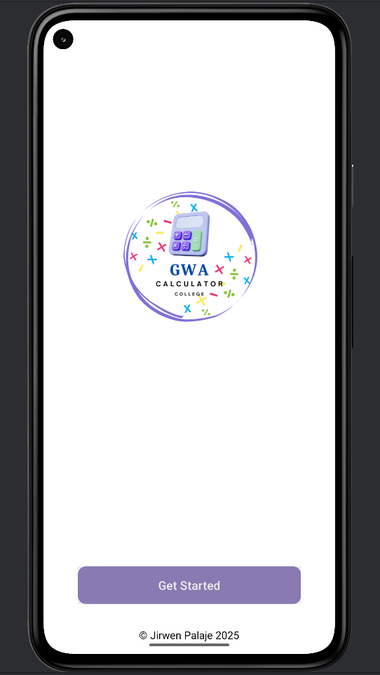
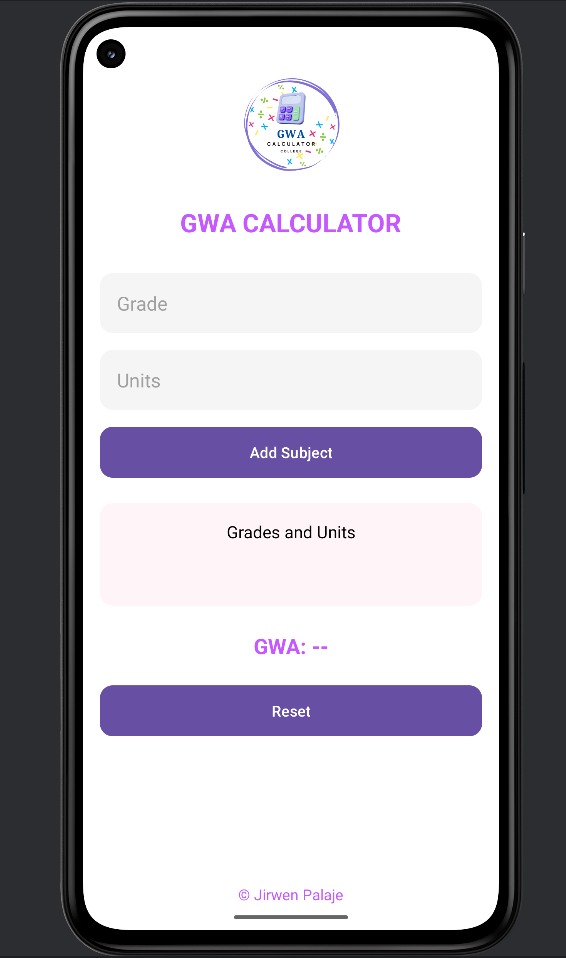

📊 GWA Calculator
An elegant and user-friendly Android application built with Kotlin that helps students compute their General Weighted Average (GWA) efficiently. Designed with a modern UI, this app features a sleek interface, intuitive controls, and clean design for an easy academic utility experience.

🚀 Features
✨ Modern UI with glassmorphism style

➕ Add subjects with grade and units

🔢 Instantly compute GWA

♻️ Reset fields and results easily

📱 Clean and responsive layout

🖼️ Welcome screen with animated logo and circular Get Started button

📷 Screenshots

Welcome Screen

  

GWA Calculation

🛠️ Built With
Kotlin

Android Studio

XML for Layouts

ConstraintLayout & ScrollView

Custom drawables and modern UI elements

🧠 How It Works
Launch the app – you'll land on the Welcome screen.

Tap Get Started to proceed to the GWA Calculator.

Input your subject's grade and units, then tap Add Subject.

Repeat for multiple subjects, then tap Compute GWA.

You may Reset at any time to clear the fields.

👤 Author
Jirwen Palaje

GitHub: @jirwenpalaje

Facebook: fb.com/jirwenpalaje

Email: palajejirwen@gmail.com 

